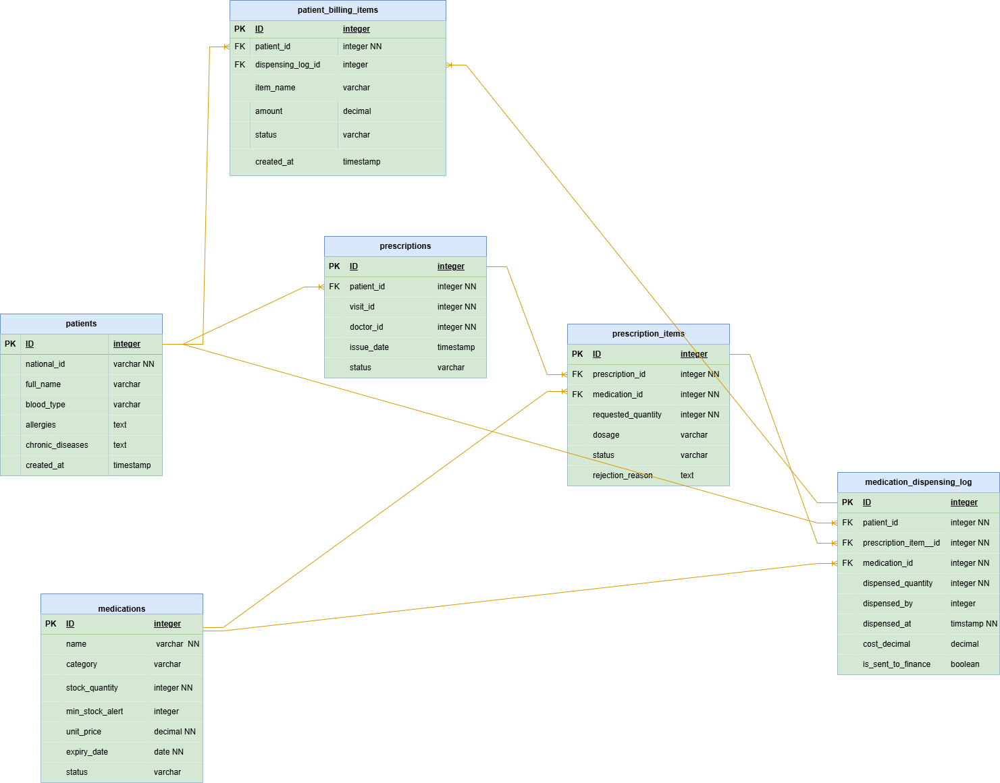

# Database Schema

## 1. Entity-Relationship Diagram (ERD)

## 2. Tables List
*List the main tables in your database. (Note: Patients and Risk_Profiles are managed by Module 1, we only reference them).*

| Table Name | Purpose / Description |
| :--- | :--- |
| `Medication` | كتالوج الأدوية وإدارة المخزون، يتضمن الكميات المتاحة، تاريخ الانتهاء، الحد الأدنى للتنبيه، وسعر الوحدة. |
| `Prescription` | رأس الوصفة الطبية، يربط الوصفة بالمريض (عبر `patient_national_id`) والزيارة والطبيب. |
| `PrescriptionItem` | تفاصيل عناصر الوصفة (الأدوية المطلوبة)، تشمل الكمية، الجرعة، حالة الصرف، وسبب الرفض إن وجد. |
| `DispensingLog` | سجل التدقيق (Audit Log / MAR)، يثبت عملية صرف الدواء فعلياً للمريض ويحسب تكلفتها. |
| `MedicalService` | جدول الخدمات الطبية (مشترك مع Module 2)، يحدد اسم الخدمة، سعرها، والقسم التابع له (مثل صيدلية). |
| `PatientBillingItem` | بنود فواتير المريض، الجدول الوسيط الذي يربط الخدمات المقدمة بالنظام المالي والتأمين. |

---

## 3. Shared Data (Integration Points)
*Which tables or data do you share with other teams?*

*   **Shared Table/ID:** `Patients` & `Risk_Profiles` (Specifically `national_id`, `allergies`, `chronic_diseases`, `blood_type`)
    *   **Shared With:** Module 1 (Admission & Medical Coding) 
    *   **Integration Details:** نستقبل الرقم الوطني (`national_id`) كمفتاح أساسي لربط الوصفات والفواتير بالمريض. وقبل أي عملية صرف، نقوم بقراءة جدول `Risk_Profiles` الخاص بهم للتأكد من عدم وجود حساسيات (`allergies`) أو أمراض مزمنة (`chronic_diseases`) تتعارض مع الدواء.

*   **Shared Table/ID:** `PatientBillingItem` & `MedicalService` (Specifically `medical_service_id`, `dispensing_log_id`, `amount`, `status`, `patient_national_id`)
    *   **Shared With:** Module 2 (Finance & Insurance) 
    *   **Integration Details:** نرسل تكلفة الأدوية المصروفة تلقائياً كبنود فواتير مرتبطة بالرقم الوطني للمريض (`patient_national_id`) والخدمة الطبية لتحسبها ضمن الفاتورة الشاملة أو التأمين.

*   **Shared Table/ID:** `Medication` (Specifically `stock_quantity`, `min_stock_alert`)
    *   **Shared With:** Module 7 (Inventory & Supplies Management) 
    *   **Integration Details:** نرسل تنبيهات عند وصول مخزون الدواء للحد الأدنى لطلب تزويد، ونتلقى تحديثات الكميات منهم.

*   **Shared Table/ID:** `Prescription` (Specifically `visit_id`, `doctor_id`, `patient_national_id`)
    *   **Shared With:** Module 1 / Clinic Module 
    *   **Integration Details:** نستقبل رقم الزيارة والطبيب والرقم الوطني لربط الوصفة الطبية بالزيارة الحالية للمريض.
